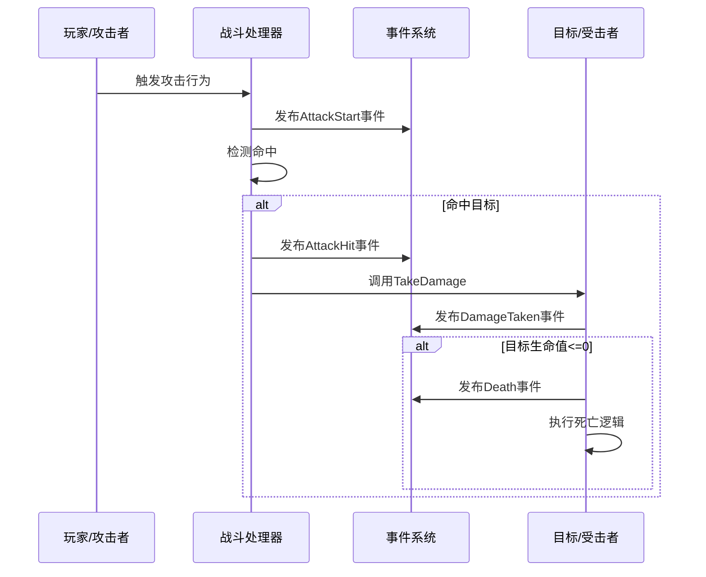
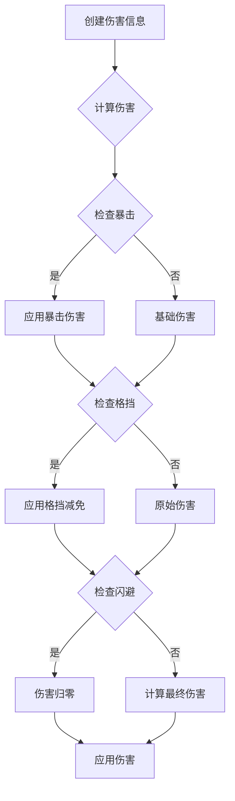
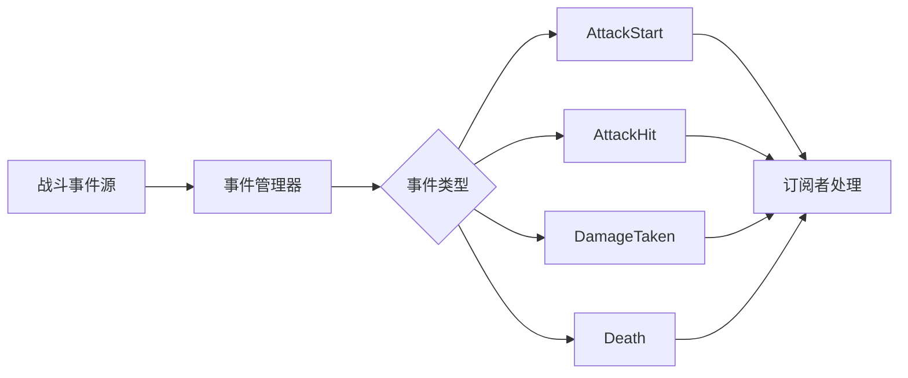
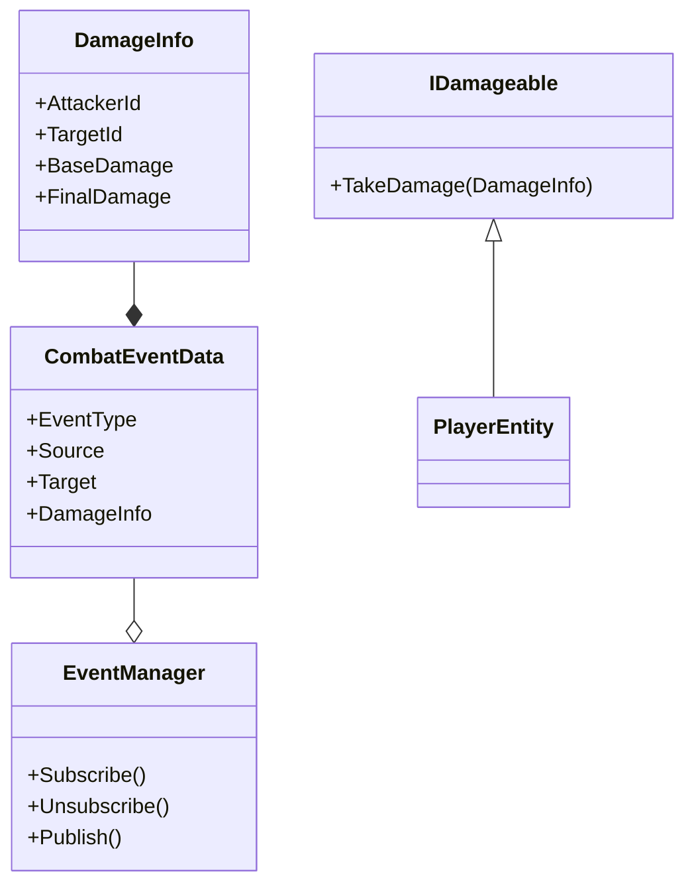

### 项目基本结构

Assets/
├── ArtRes/ ——纯美术资源

├── AssetBundles/ 

├── Res/ —— 预制体资源

├── Scenes/—— 场景资源

├── Scripts/ —— 主要代码
│   ├── Common/ —— 通用的一些类、包括单例、工具类
│   ├── Core/ —— 和组件有耦合的全局管理类
│   ├─────AssetBundles
│   ├─────Scene
│   ├── Entity/ —— 游戏数据类
│   ├── Player/ —— 角色逻辑
│   ├── Network/
│   └── UI/
│
├── Editor/ —— 编辑器扩展代码

├── Tables/ —— 配置表

└── Resources/         （必要时的动态加载资源）
    ├── Configs/      （比如AssetBundle的配置表）

### 项目生命周期

首先游戏从主界面起点，....

### 实体加载流程

目前是这样打算的，在一个和游戏组件耦合的mono单例类中，

### 数据规范

##### SaveData

每个玩家的存档信息
存档包括BasicPlayerInfo、上次存档时间

##### Entity

用来管理游戏内实体的数据类
ID：在对象引用集合字典中的唯一确定标识
GameObject：对应游戏内的GameObject引用

##### PlayerEntity:Entity

BasicPlayerInfo：这里保存玩家需要存档的一些信息，血量，外形数据之类的

##### PlayerAppearanceData

这里保存玩家的外观信息，每个可变的外观数据都用int或者颜色值表示

明天我需要做的 是用编辑器加一个新建玩家存档入口的按钮，然后测试ab包和存档系统是否正常

### 资源加载

#### 加载流程

项目内所有的资源加载都调用IResourceLoader接口内的T LoadAsset<T>与 Task<T> LoadAssetAsync<T>

运行时代码统一调用resourceLoader类中的加载方法，该类在编辑器模式用正常资源，而在发行版用ab包资源

AssetBundle 的标签（或名称）**与 `Assets/Res`**下的资源一一对应，标签也是这么生成的。这是约定，方便参数传入IResourceLoader实现类EditorResourceLoader和AssetBundleResourceLoader。

#### 标签约定

标签约定为xxx xxx是Assets/Res下的一级子目录的文件夹名，发行版运行时好理解，就是用bundlename和assetname用ab加载器获得资源。editor运行时代码通过 索引表机制，只需要关心逻辑上的 `bundleName + assetName`，不再关心文件夹结构或扩展名，就能用AssetDatabase定位资源。

#### ab包

| 场景                  | 使用路径                                 | 说明               |
| --------------------- | ---------------------------------------- | ------------------ |
| Unity 编辑器运行时    | `Application.dataPath + "/../ab"`        | 外部打包、方便调试 |
| 打包后 Windows 运行时 | `Application.streamingAssetsPath`        | 内嵌进构建包中     |
| Android / iOS         | `Application.persistentDataPath + "/ab"` | 支持运行时更新资源 |

所以事实上应该是运行时读取应该用预编译条件 但是我打包到编辑器/../AssetBundle和streamingAssetsPath 还是要在打包之前就应该手动处理的，然后在安卓和其他移动端应该在首次启动的时候进行压缩并拷贝

unityEditor菜单工具(资源工具)：
编辑器AB包生成——打editor运行用的ab资源包
设置所有xxx的AssetBundle标签——打标签

### 动作规范

#### 角色动作

标准命名：Idle、Jump、Walk、Run。这些命名由于会在美术资源的AnimatorController中，所以需要特别约定与规范

### 交互

Settings/ControlSetting中

### 战斗

### 安卓

先强调一下调试不同平台资源的方法。不同平台用不同的资源加载器详见ResourceLoader类。
该类中isEditorMode可以强行修改windows平台编辑器中用发行版的资源，设为false则在windows编辑器中用editor资源
ab资源在 工具栏-资源工具-AB包编辑器生成 然后 工具栏-资源工具-生成发行版AB包并复制进StringmingAssets。做完这两步之后，build不同平台的包体就会有对应ab包资源了。
安卓方法见下面开发流程。

##### apk内目录：

assets/
└── AssetBundle/
    └── Android/
        ├── Android (主manifest文件)
        ├── characters
        └── tables

##### 开发流程：

1.在unityhub下载unity安卓工具包，用安卓模式启动该项目
2.usb连接安卓真机，开启usb调试
3.buildSettings中，配置DevelopmentBuild、ScriptDebugging、WaitForMnagedDebugger为true，方便调试
4.想看控制台输出，就在控制台的Editor那切换成安卓机；想看断点，就在vs工具栏-调试-附加Unity调试程序

##### ab包资源调用方法：

首先安卓资源在unity工具内打包到assets/StreamingAsset/AssetBundle/Android/中，然后buildSettings中打包，输出结构见apk内目录
资源加载见ABInitializer中，首先用UnityWebRequest拿到assets/StreamingAsset/AssetBundle/Android/中的Android.manifest，根据ab清单遍历该文件夹的所有ab资源，存到一个数组。遍历结束后把streamingABPath资源用UnityWebRequest拷贝到persistentABPath中。
（注：必须用UnityWebRequest拿$"jar:file://{Application.dataPath}!/assets/{abRoot}/Android"路径）

##### 移动端ui和输出适配：

详见类MobileUIController、InputManager。
如果当前是移动端，那么显示指定UI。这些UI父级容器设为1920x1080，然后拖动这些ui的锚点到左下右下等位置。
还要设Canva的CanvasScaler组件为ScaleWithScreenSize。
输入输出适配：按钮输出和输出都用Unity最新的InputActions的遥感输入输出。
在InputManager中管理InputActions的输入状态，别的类在这个单例取状态。
这里特别需要注意的是遥感和视角移动和缩放的冲突问题。
解决方法是遥感操作的时候，两个手指输入并不会判定为缩放的情况。
